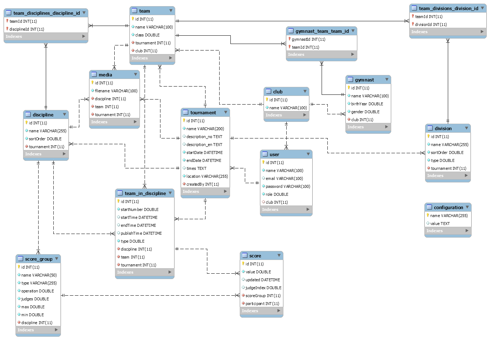

# GymSystems

[](https://greenkeeper.io/)
[](https://travis-ci.org/OysteinAmundsen/gymsystems)
[](https://david-dm.org/OysteinAmundsen/gymsystems)
[](https://david-dm.org/OysteinAmundsen/gymsystems#info=devDependencies)
[](https://github.com/OysteinAmundsen/gymsystems/issues)
[](https://twitter.com/intent/tweet?text=Wow:&url=https%3A%2F%2Fgithub.com%2FOysteinAmundsen%2Fgymsystems)

This is a complete web based system for managing the secretariat for Team Gymnastic sports. There are not many proffesional scoring or managing systems available, and therefore we saw the need for creating one. And since these minority sports are typically not funded, and therefore prone to voluntary work, we wanted this system to be a community open-source project as well. We will therefore never ask for money for this system, but instead wecome improvements through pull-requests.

The system is now running live on [www.gymsystems.org](http://www.gymsystems.org), but you are welcome to host this yourself if you require a clean stack. Please read the [installation guide](#installation) below for detailed instructions on how to set this up.

We've developed a comprehensive users manual over at our [wiki](../../wiki). This should describe in depth how the system is to be used. If you feel that the manual is missing some information, feel free to open a new [issue](../../issues), and we will add or clarify. 

## Table of contents

* [Installation](#installation)
* [How to use (own wiki space)](../../wiki)
* [Development](#development)
  - [Database](#database)
  - [Server](#server)
  - [Client](#client)
* [Architecture](#architecture)

## Installation

[](https://cloud.docker.com/stack/deploy/) 

This system is written entirely in Typescript. It is intended to be run in a docker container, but it is flexible enough to setup any which way you want. 
Install on your own docker-cloud container stack using this button, or follow the manual installation guide below.


**NOTE:** If you want to devlop on this project, you should look at the [development](#development) info below, as doing a full `docker-build` is not required for development. 


### Manual installation

In order to install and setup the system manually, you need to install the following first:

* [NodeJS](https://nodejs.org/) 7 or higher
* [Docker](https://www.docker.com/)


For a production ready deployment, do this:

```bash
npm install
npm run deploy
```

The [`deploy`](./docker-build) script will setup both the application docker container and the database container. 

* **gymsystems** - built from [gymsystems/client](./Dockerfile) docker image
* **gymsystems_db** - built from [stock dockerhub mysql](https://hub.docker.com/_/mysql/) image

They're put together using `docker-compose` and should be available on port 80 of you docker-machine.

If all you want to do is startup this project, your pretty much done now. The application should be available on `http://[docker-machine]` <- which usually is [localhost](http://localhost)


## Development

We welcome pull-requests to our system. We therefore want you to be able to setup a development environment quickly and easily. The information below should be all you as a developer require to get up and running quickly, and make all the changes you want. 

### Database

For development, you don't need a docker container for the application. You only need a database. The following will build out a docker container for your database:

```bash
npm run docker:dev
```
The docker container shoud be setup with a volume mounted from your local file system, so that data will be persisted even if the docker container goes down, is rebuilt or, for whatever other reason, dissapears.

### Server

You can start the server bit of this project up in three ways:

1. Build once and serve

  ```bash
  npm run build
  npm run server
  ```

  This will build the backend **and frontend**, and start up the server on [localhost:3000](http://localhost:3000). 

2. Build continously and serve

  ```bash
  npm run dev
  ```
  This command will continuously build the backend while you develop, and restart the Node Express server when build is done. This will not affect changes you make in the `client` though. 
  
  **This will not build the frontend**. In this mode, you only have the server. You will need to start the [client](#client) in a separate process.

3. Build continously and **debug**

  ```bash
  npm run server:build:watch
  ```
  This command will continously build the backend while you develop. It will not start the server though. We like to use VSCode, and have included VSCode launch settings in this repository for you. Choose to debug `Server` in VSCode, and you are up. When you do changes to the code, the server will rebuild and your debugging session will restart automatically.

  **This will not build the frontend**. In this mode, you only have the server. You will need to start the [client](#client) in a separate process.

### Client

```bash
npm run client
```

This will run a continuous build and browsersync session for the frontend. Use this if you are developing the client. This starts up a small development server on [localhost:4200](http://localhost:4200), with a proxy to the backend so all api calls will work seamlessly. 

## Architecture

We've based the system on a NodeJS Express server using MySQL backend over Docker, serving an Angular 2 frontend. 

### Server

We chose a NodeJS Express backend for this, as it was the easiest to setup and is super-fast. The database connection is handled by [`TypeORM`](https://typeorm.github.io), and the whole server concists basically of CRUD controllers using [`routing-controllers`](https://github.com/pleerock/routing-controllers) and [`typeorm-routing-controllers-extension`](https://github.com/typeorm/typeorm-routing-controllers-extensions). This was super-easy to setup and is feels very similar to Spring for Java.

### Client

We use [angular-cli](https://cli.angular.io/) for both scaffolding and building our project. This seems to be the best and most efficient way of reaching our goal.

### Data model

`TypeORM` is inspired by large scale ORM solutions like `Hibernate`, which means it supports both schema synchronisation and migrations. This is great as we keep all our structure in code instead of relying on `sql` scripts for setup. 


