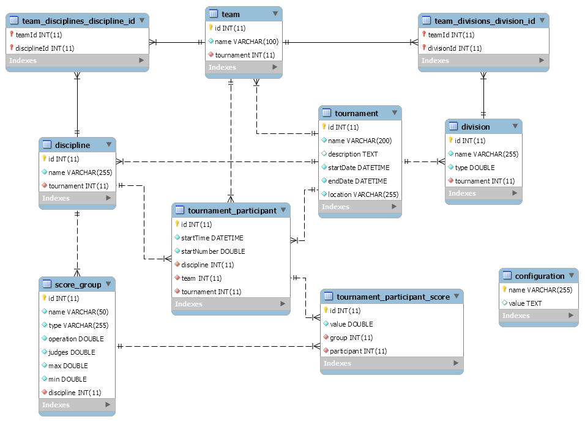

# GymSystems

This is a complete web based system for managing the secretariat for Team Gymnastic sports. There are not many proffesional scoring or managing systems available, and therefore we saw the need for creating one. And since these minority sports are typically not funded, and therefore prone to voluntary work, we wanted this system to be a community open-source project as well. We will therefore never ask for money for this system, but instead wecome improvements through pull-requests.

We've based the system on a NodeJS Express server using MySQL backend over Docker, serving an Angular 2 frontend. 


## Note

This project is still a work in progress. 


## Prerequisites

You need to install the following:

* [NodeJS](https://nodejs.org/) 4 or higher (We reccommend the 6 LTS version)
* [Docker](https://www.docker.com/)


## Table of contents

* [Installation](#installation)
* [Development](#development)
* [Architecture](#architecture)

## Installation

**BEFORE YOU INSTALL:** please read the [prerequisites](#prerequisites)
```bash
npm install
./docker-build
```

After running these commands, you will have two docker containers up and running. 

* **gymsystems** - built from [gymsystems/client](./Dockerfile) docker image
* **gymsystems_db** - build from [gymsystems/db](.docker/db/Dockerfile) docker image

They're put together using [docker-compose](./docker-compose.yml) and should be available on port 3000 of you docker-machine.


## Development

We've put together a couple of npm scripts which will ease the development cycle immensely. 

**NOTE!** You will require the [gymsystems/db](.docker/db/Dockerfile) docker container, or a local mysql equivalent installed locally, in order to run the application. We recommend the docker container, as this is less of a hassle to setup correctly.  

### Backend

```bash
npm run build:server:watch
```

This command will continuously build the backend while you develop. 

```bash
npm run start:server:watch
```

You will need to start a separate shell in order to run the server though, this command uses `nodemon` to restart the server automatically upon changes. 

### Frontend

```bash
npm run start:client
```

This will run a continuous build and browsersync session for the frontend. Use this if you are developing the client.


### Fullstack (windows)

We've added a shortcut for the three commands above. Just type:
```bash
npm run dev
```
This will only work on windows. It opens three separate shells hosting each of the npm scripts noted above.

## Architecture
### Server

We chose a NodeJS Express backend for this, as it was the easiest to setup and is super-fast. The database connection is handled by [`TypeORM`](https://typeorm.github.io), and the whole server concists basically of CRUD controllers using [`routing-controllers`](https://github.com/pleerock/routing-controllers) and [`typeorm-routing-controllers-extension`](https://github.com/typeorm/typeorm-routing-controllers-extensions). This was super-easy to setup and is feels very similar to Spring for Java.

### Client

We use [angular-cli](https://cli.angular.io/) for both scaffolding and building our project. This seems to be the best and most efficient way of reaching our goal.

### Data model

`TypeORM` is inspired by large scale ORM solutions like `Hibernate`, which means it supports both schema synchronisation and migrations. This is great as we keep all our structure in code instead of relying on `sql` scripts for setup. 




ssh gymsystems@gymsystems.cloudapp.net
