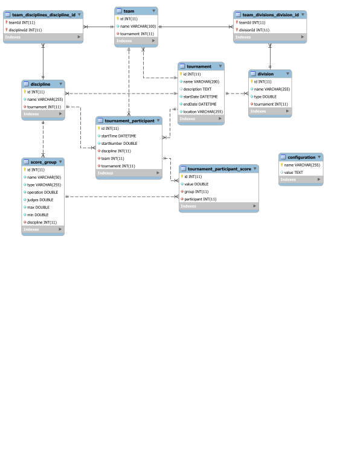

# Gymsystems #

This is a complete web based system for managing the secretariat for Team Gymnastic sports. There are not many proffesional scoring or managing systems available, and therefore we saw the need for creating one. And since these minority sports are typically not funded, and therefore prone to voluntary work, we wanted this system to be open-source as well. We will therefore never ask for money for this system, but instead ask you to donate your time and efforts to improve the system.

We've based the system on a NodeJS Express server using MySQL backend over Docker, serving an Angular 2 frontend. 


## How to run ##

### Prerequisites ###

You need to install the following:

* [NodeJS](https://nodejs.org/)
* [Docker](https://www.docker.com/)

### Build and run ###

```bash
npm install
npm run build
./docker-build
```

After running these commands, you will have two docker containers up and running. 

* **gymsystems** - built from [gymsystems/client docker image](./Dockerfile)
* **gymsystems_db** - build from [gymsystems/db docker image](.docker/db/Dockerfile)

They're put together using [docker-compose](./docker-compose.yml) and should be available on port 3000 of you docker-machine.

#### While deveoping backend ####

`npm run build:server:watch`

If you allready have built the docker containers, you can run the server in development mode using this command, which will continously build the backend while you develop. 

`npm run start:server`

You will need to start a separate shell in order to run the server though, and there is no hot-reload implemented, so you need to restart the server each time you want to test your changes.

#### While deveoping frontend ####

`npm run start:client`

This will run a continous build and browsersync session for the frontend. Use this if you are developing the client.


## Three-tier architecture ##
### Server ###

We chose a NodeJS Express backend for this, as it was the easiest to setup and is super-fast. The database connection is handled by [`TypeORM`](https://typeorm.github.io), and the whole server concists basically of CRUD controllers using [`routing-controllers`](https://github.com/pleerock/routing-controllers) and [`typeorm-routing-controllers-extension`](https://github.com/typeorm/typeorm-routing-controllers-extensions). This was super-easy to setup.

### Client ###

We use [angular-cli](https://cli.angular.io/) for both scaffolding and building our project. This seems to be the best and most efficient way of reaching our goal.

### Data model ###

`TypeORM` is inspired by large scale ORM solutions like `Hibernate`, which means it supports both schema synchronisation and migrations. This is great as we keep all our structure in code instead of relying on `sql` scripts for setup. 



