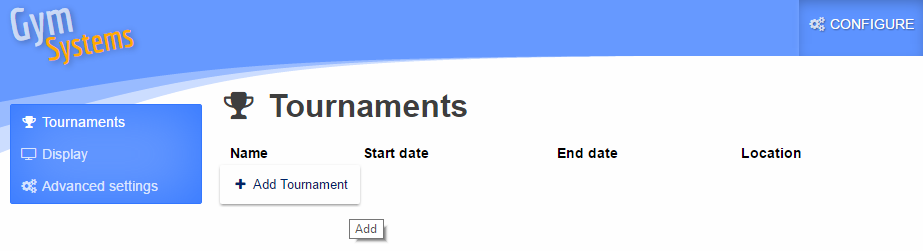
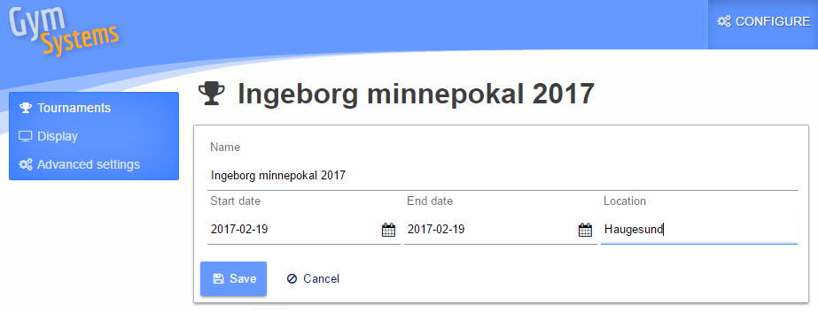
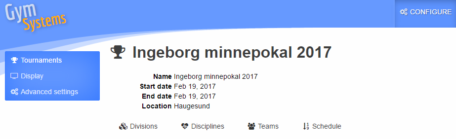
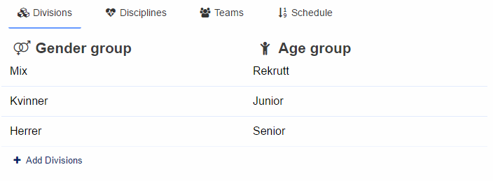
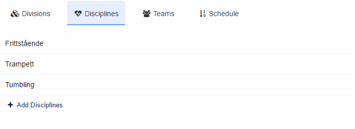
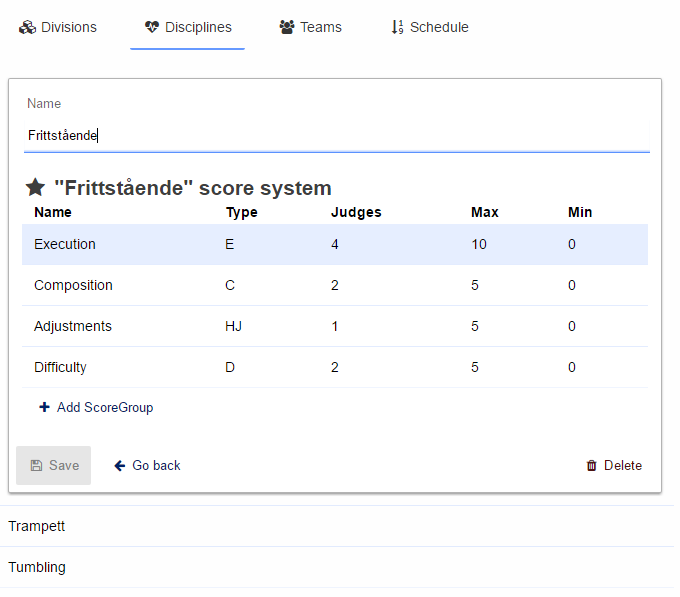
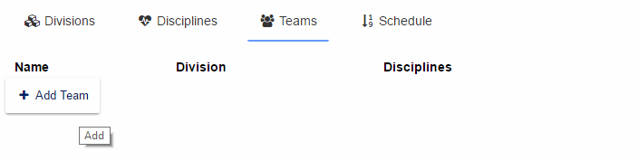
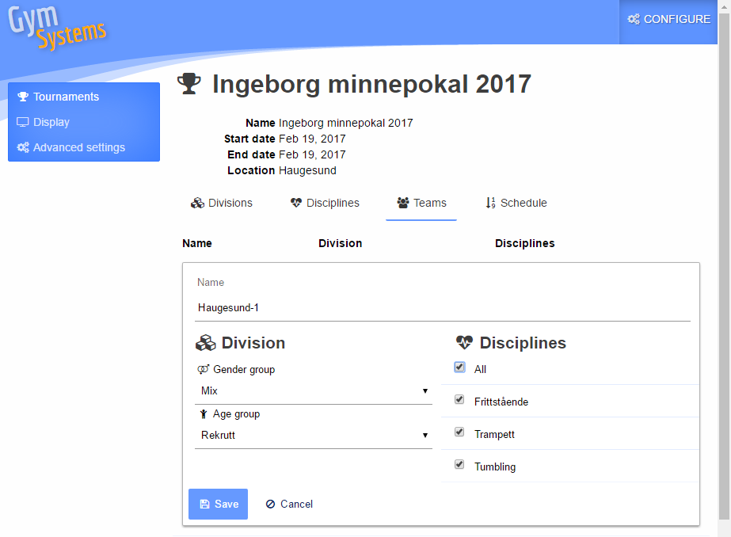
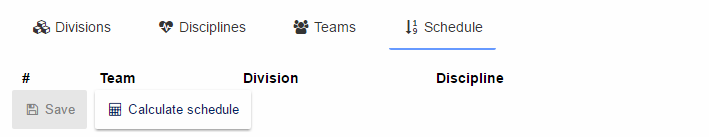
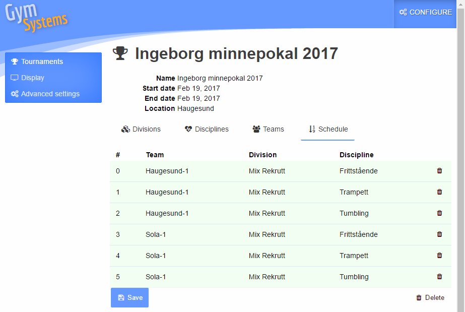

# Adding a tournament #

In order to add a new tournament, you need to be logged in as a user with `Admin` privileges.
From the `Configure` menu, click `Add tournament`.

Fill out the form that pops up, 

 
and click save.

This will automatically create a few default values

These default values are editable. Click on the row to get an editor, or drag and drop to edit the sequence in which they appear.

 
When you are happy with both the content and the sequence, you can add teams. There is a authentication role `Club` which can be applied to given users, allowing them to log in and get access to add their own teams to this tournament. 

 
Choose `Teams` and `Add team`

 
A team has a name, a division and one or more disciplines to compete in.

 
When you are done adding teams, you can create a schedule. The schedule can be created and re-created many times, so you can setup a preliminary schedule before all clubs are done adding teams.

 
Choose `Schedule` and `Calculate schedule`

 
If for some reason you are unhappy with the sequence in which teams appear in the schedule, you are allways welcome to drag and drop teams in the list. But be aware that if you re-create the schedule, any customizations you have done will dissappear.
 
When you are happy, click `Save`

The tournament schedule is now available for the public.
 